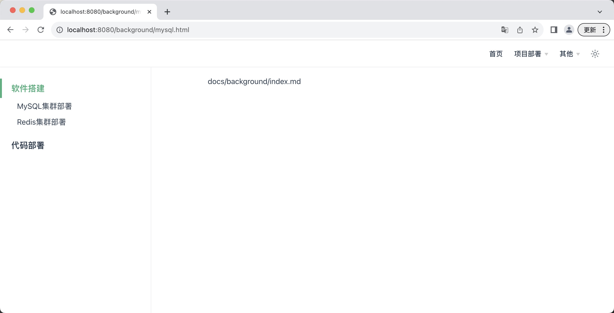

```text
https://v2.vuepress.vuejs.org/zh/reference/default-theme/config.html#navbar
```

```text
// 导航栏出不来尝试加下这个
"vuepress-plugin-demoblock-plus": "^2.0.4"
```

# 1、docs/.vuepress/config.ts
```ts
// docs/.vuepress/config.ts
import { defaultTheme } from 'vuepress'

// 定义导航栏配置
const navbar = [
  // 导航项可以是一个直接的链接
  {
    text: '首页',
    link: '/',
  },
  // 或者包含下拉菜单的对象
  {
    text: '项目部署',
    children: [
      {
        text: '后端部署',
        link: '/background/',
      },
      {
        text: '前端部署',
        link: '/front/',
      },
    ],
  },
  // 支持外部链接
  {
    text: '其他',
    children: [
      {
        text: 'GitHub',
        link: 'https://github.com/your-repo',
      },
    ]
  },
];

// 定义侧边栏配置
const sidebar = {
  // 为特定路径设置侧边栏
  '/background/': [
    {
      text: '软件搭建',
      link: '/background/index.md',
      children: [
        { text: 'MySQL集群部署', link: '/background/mysql.md' },
        { text: 'Redis集群部署', link: '/background/redis.md' },
      ],
    },
    {
      text: '代码部署',
    },
  ],
  '/front/': [
  ],
  // 外部链接，不用设置侧边栏，因为是直接跳转

  // 其他路径的侧边栏配置...
};


export default {
  theme: defaultTheme({
    // 使用 navbar 变量作为导航栏配置
    navbar,
    // 使用 sidebar 变量作为侧边栏配置
    sidebar,
    // ...其他主题配置
  }),
  // ...其他 VuePress 配置
};
```

# 2、参考
