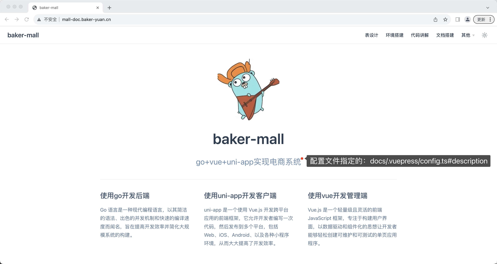

# 1、位置
docs/README.md

# 2、添加内容
```text
---
home: true
heroImage: /img/log3.png
heroText: baker-mall
features:
  - title: 使用go开发后端
    details: Go 语言是一种现代编程语言，以其简洁的语法、出色的并发机制和快速的编译速度而闻名，旨在提高开发效率并简化大规模系统的构建。
  - title: 使用uni-app开发客户端
    details: uni-app 是一个使用 Vue.js 开发跨平台应用的前端框架，它允许开发者编写一次代码，然后发布到多个平台，包括 Web、iOS、Android、以及各种小程序环境，从而大大提高了开发效率。
  - title: 使用vue开发管理端
    details: Vue.js 是一个轻量级且灵活的前端 JavaScript 框架，专注于构建用户界面，以数据驱动和组件化的思想让开发者能够轻松创建可维护和可测试的单页应用程序。
---
```

# 3、效果

