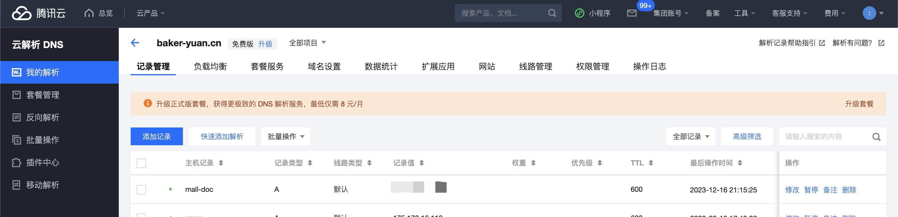
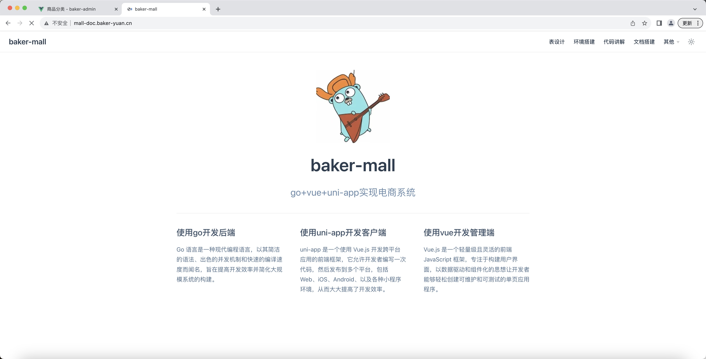

# 1、新增域名


# 2、目录
```text
部署目录：/data/project/release/mall-doc
nginx配置：/usr/local/nginx/conf/vhost
```

# 2、nginx配置文件
> 新增的`文档部署`是在博客nginx上增加的一个，其他配置请参考 http://www.baker-yuan.cn/articles/62

```bash
cp baker_blog_view.conf mall-doc.conf
```
```bash
server {
    listen 80;
    server_name mall-doc.baker-yuan.cn;
    location / {
        root /data/project/release/mall-doc;
        index index.html;
    }
}
```

# 3、打包构建上传
```bash
nvm use v18.16.1 && pnpm docs:build
```

# 4、启动nginx
```text
cd /usr/local/nginx/sbin
./nginx -s reload
```

# 5、访问
```text
http://mall-doc.baker-yuan.cn/
```
