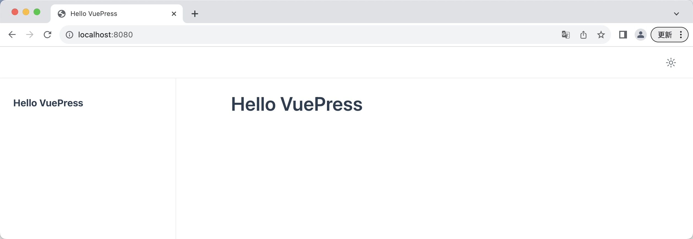

# 1、官方文档
```text
https://v2.vuepress.vuejs.org/zh/
https://v2.vuepress.vuejs.org/zh/guide/getting-started.html#手动安装
```

1、创建并进入一个新目录
```bash
mkdir vuepress-starter
cd vuepress-starter
```

2、初始化项目
```bash
git init
pnpm init
```

3、将 VuePress 安装为本地依赖
```bash
pnpm add -D vuepress@next @vuepress/client@next vue
```

4、在 package.json 中添加一些 scripts
```text
{
  "scripts": {
    "docs:dev": "vuepress dev docs",
    "docs:build": "vuepress build docs"
  }
}
```

5、将默认的临时目录和缓存目录添加到 .gitignore 文件中
```bash
echo 'node_modules' >> .gitignore
echo '.temp' >> .gitignore
echo '.cache' >> .gitignore
```


6、创建你的第一篇文档
```bash
mkdir docs
echo '# Hello VuePress' > docs/README.md
```

7、在本地启动服务器来开发你的文档网站
```bash
pnpm docs:dev
```

> VuePress 会在 http://localhost:8080 启动一个热重载的开发服务器。当你修改你的 Markdown 文件时，浏览器中的内容也会自动更新。


# 2、效果
## 2.1、tree
```text
~/code/test/vuepress/vuepress-starter » tree
.
|____pnpm-lock.yaml
|____.DS_Store
|____docs
| |____README.md
| |____.vuepress
|____.gitignore
|____package.json
```
## 2.2、package.json
```text
{
  "name": "vuepress-starter",
  "version": "1.0.0",
  "description": "",
  "main": "index.js",
  "scripts": {
    "test": "echo \"Error: no test specified\" && exit 1",
    "docs:dev": "vuepress dev docs",
    "docs:build": "vuepress build docs"
  },
  "keywords": [],
  "author": "",
  "license": "ISC",
  "devDependencies": {
    "@vuepress/client": "2.0.0-rc.0",
    "vue": "^3.3.12",
    "vuepress": "2.0.0-rc.0"
  }
}
```
## 2.3、效果

