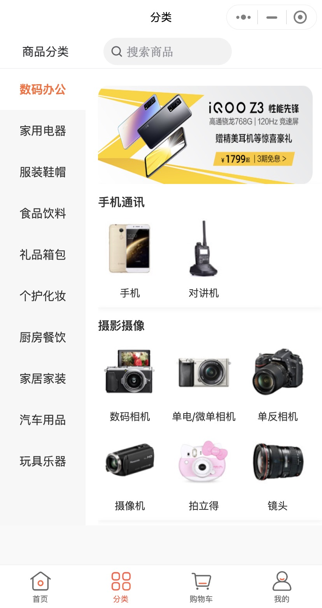

# 1、表设计 li_category
字段名 | 描述
--- | ---
`id` | ID
`parent_id` | 父ID
`level` | 层级
`name` | 分类名称
`image` | 分类图标
`sort_order` | 排序值
commission_rate | 佣金比例
support_channel | 是否支持频道
create_by | 创建者
create_time | 创建时间
update_by | 更新者
update_time | 更新时间
delete_flag | 删除标志 true/false 删除/未删除

# 2、页面效果

# 3、数据
