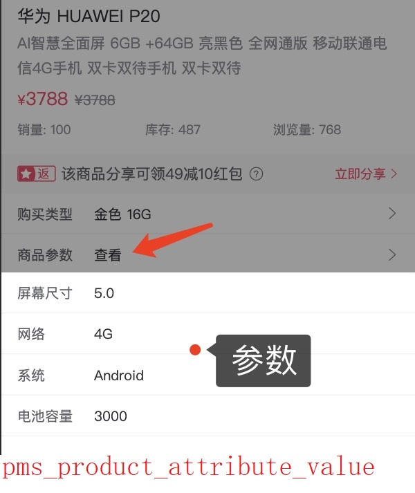

[[toc]]

# 1、表设计
## 1.1、商品属性分类表
```sql
CREATE TABLE `pms_product_attribute_category`
(
    `id`              bigint      NOT NULL AUTO_INCREMENT COMMENT '编号',
    `name`            varchar(64) NOT NULL DEFAULT '' COMMENT '类型名称',
    `attribute_count` int         NOT NULL DEFAULT '0' COMMENT '属性数量',
    `param_count`     int         NOT NULL DEFAULT '0' COMMENT '参数数量',
    `created_at`      int         NOT NULL DEFAULT '0' COMMENT '创建时间',
    `updated_at`      int         NOT NULL DEFAULT '0' COMMENT '修改时间',
    PRIMARY KEY (`id`)
) ENGINE = InnoDB
  DEFAULT CHARSET = utf8mb4
  COLLATE = utf8mb4_0900_ai_ci COMMENT ='商品属性分类表';
```

## 1.2、商品属性表
```sql
CREATE TABLE `pms_product_attribute`
(
    `id`                            bigint       NOT NULL AUTO_INCREMENT COMMENT '编号',
    `type`                          tinyint      NOT NULL DEFAULT '0' COMMENT '属性的类型；0->规格；1->参数',
    `product_attribute_category_id` bigint       NOT NULL DEFAULT '0' COMMENT '产品属性分类表ID',
    `name`                          varchar(64)  NOT NULL DEFAULT '' COMMENT '属性名称',
    `select_type`                   tinyint      NOT NULL DEFAULT '0' COMMENT '属性选择类型：0->唯一；1->单选；2->多选',
    `input_type`                    tinyint      NOT NULL DEFAULT '0' COMMENT '属性录入方式：0->手工录入；1->从列表中选取',
    `input_list`                    varchar(255) NOT NULL DEFAULT '' COMMENT '可选值列表，以逗号隔开',
    `sort`                          int          NOT NULL DEFAULT '0' COMMENT '排序字段',
    `filter_type`                   tinyint      NOT NULL DEFAULT '0' COMMENT '分类筛选样式：1->普通；1->颜色',
    `search_type`                   tinyint      NOT NULL DEFAULT '0' COMMENT '检索类型；0->不需要进行检索；1->关键字检索；2->范围检索',
    `related_status`                tinyint      NOT NULL DEFAULT '0' COMMENT '相同属性产品是否关联；0->不关联；1->关联',
    `hand_add_status`               tinyint      NOT NULL DEFAULT '0' COMMENT '是否支持手动新增；0->不支持；1->支持',
    `created_at`                    int          NOT NULL DEFAULT '0' COMMENT '创建时间',
    `updated_at`                    int          NOT NULL DEFAULT '0' COMMENT '修改时间',
    PRIMARY KEY (`id`)
) ENGINE = InnoDB
  DEFAULT CHARSET = utf8mb4
  COLLATE = utf8mb4_0900_ai_ci COMMENT ='商品属性表';
```

## 1.3、商品属性值表
```sql
CREATE TABLE `pms_product_attribute_value`
(
    `id`                   bigint      NOT NULL AUTO_INCREMENT COMMENT '主键ID',
    `product_id`           bigint      NOT NULL DEFAULT '0' COMMENT '商品ID',
    `product_attribute_id` bigint      NOT NULL DEFAULT '0' COMMENT '商品属性ID',
    `value`                varchar(64) NOT NULL DEFAULT '' COMMENT '手动添加规格或参数的值，参数单值，规格有多个时以逗号隔开',
    `created_at`           int         NOT NULL DEFAULT '0' COMMENT '创建时间',
    `updated_at`           int         NOT NULL DEFAULT '0' COMMENT '修改时间',
    PRIMARY KEY (`id`)
) ENGINE = InnoDB
  DEFAULT CHARSET = utf8mb4
  COLLATE = utf8mb4_0900_ai_ci COMMENT ='商品属性值表';
```

> 1、如果对应的商品属性是`规格`且规格支持`手动添加`(pms_product_attribute#input_type=0)，那么该表用于存储手动新增的值；
>
> 2、如果对应的商品属性是`参数`(pms_product_attribute#input_type=1)，那么该表用于存储参数的值；


## 1.4、名称解释
### 1.4.1、什么是属性
> sku表的数据来自于两张表
> 
> 1、pms_product_attribute 从列表中选取(pms_product_attribute#input_type=0)
> 
> 2、pms_product_attribute_value 手工录入(pms_product_attribute#input_type=1)


### 1.4.2、什么是参数



## 1.5、三张表的关系


