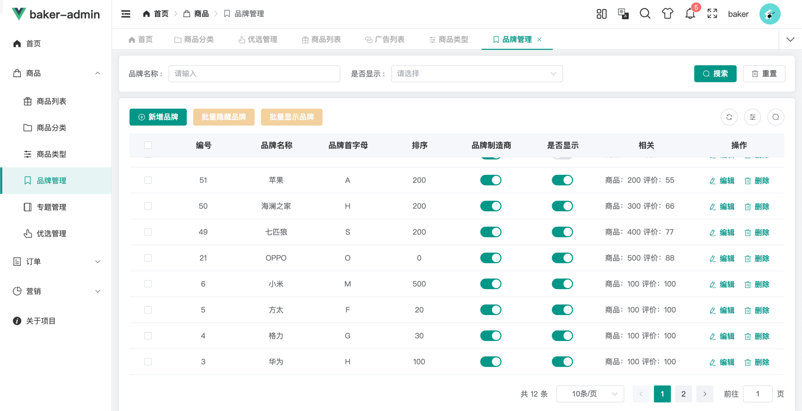

# 一、表设计
```sql
CREATE TABLE `pms_brand`
(
    `id`                    bigint       NOT NULL AUTO_INCREMENT COMMENT '主键',
    `name`                  varchar(64)  NOT NULL DEFAULT '' COMMENT '名称',
    `first_letter`          varchar(8)   NOT NULL DEFAULT '' COMMENT '首字母',
    `sort`                  int          NOT NULL DEFAULT '0' COMMENT '排序',
    `factory_status`        tinyint      NOT NULL DEFAULT '0' COMMENT '是否为品牌制造商：0->不是；1->是',
    `show_status`           tinyint      NOT NULL DEFAULT '0' COMMENT '是否显示',
    `logo`                  varchar(255) NOT NULL DEFAULT '' COMMENT '品牌logo',
    `big_pic`               varchar(255) NOT NULL DEFAULT '' COMMENT '专区大图',
    `brand_story`           text         NOT NULL COMMENT '品牌故事',
    `product_count`         int          NOT NULL DEFAULT '0' COMMENT '产品数量',
    `product_comment_count` int          NOT NULL DEFAULT '0' COMMENT '产品评论数量',
    `created_at`            int          NOT NULL DEFAULT '0' COMMENT '创建时间',
    `updated_at`            int          NOT NULL DEFAULT '0' COMMENT '修改时间',
    PRIMARY KEY (`id`)
) ENGINE = InnoDB
  AUTO_INCREMENT = 1
  DEFAULT CHARSET = utf8mb4
  COLLATE = utf8mb4_0900_ai_ci COMMENT ='商品品牌表';
```

# 2、管理页面


# 3、客户端
