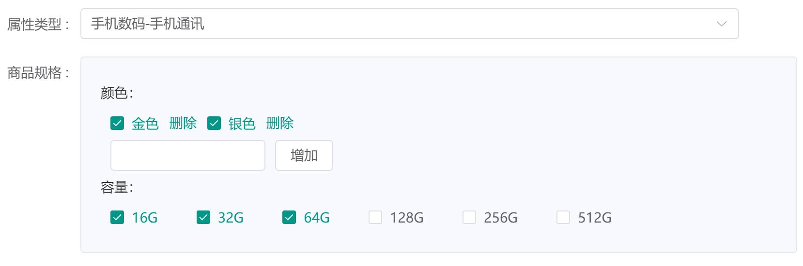
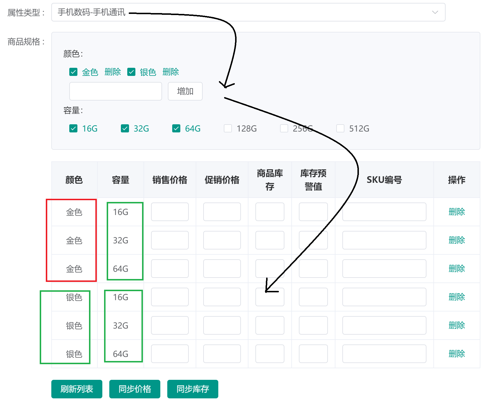
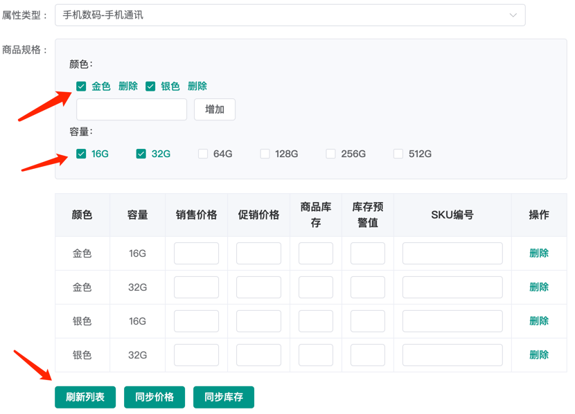

[[toc]]

# 1、表结构
## 1.1、商品表
```sql
CREATE TABLE `pms_product`
(
    `id`                            bigint         NOT NULL AUTO_INCREMENT COMMENT '主键',
    `product_category_id`           bigint         NOT NULL DEFAULT '0' COMMENT '商品分类id',
    `name`                          varchar(200)   NOT NULL DEFAULT '' COMMENT '商品名称',
    `sub_title`                     varchar(255)   NOT NULL DEFAULT '' COMMENT '副标题',
    `brand_id`                      bigint         NOT NULL DEFAULT '0' COMMENT '品牌id',
    `description`                   text           NOT NULL COMMENT '商品描述',
    `product_sn`                    varchar(64)    NOT NULL DEFAULT '' COMMENT '货号',
    `price`                         decimal(10, 2) NOT NULL DEFAULT '0.00' COMMENT '价格',
    `original_price`                decimal(10, 2) NOT NULL DEFAULT '0.00' COMMENT '市场价',
    `stock`                         int            NOT NULL DEFAULT '0' COMMENT '库存',
    `unit`                          varchar(16)    NOT NULL DEFAULT '' COMMENT '单位',
    `weight`                        decimal(10, 2) NOT NULL DEFAULT '0.00' COMMENT '商品重量，默认为克',
    `sort`                          int            NOT NULL DEFAULT '0' COMMENT '排序',
    `gift_point`                    int            NOT NULL DEFAULT '0' COMMENT '赠送的积分',
    `gift_growth`                   int            NOT NULL DEFAULT '0' COMMENT '赠送的成长值',
    `use_point_limit`               int            NOT NULL DEFAULT '0' COMMENT '限制使用的积分数',
    `preview_status`                tinyint        NOT NULL DEFAULT '0' COMMENT '是否为预告商品：0->不是；1->是',
    `publish_status`                tinyint        NOT NULL DEFAULT '0' COMMENT '上架状态：0->下架；1->上架',
    `new_status`                    tinyint        NOT NULL DEFAULT '0' COMMENT '新品状态:0->不是新品；1->新品',
    `recommand_status`              tinyint        NOT NULL DEFAULT '0' COMMENT '推荐状态；0->不推荐；1->推荐',
    `service_ids`                   varchar(64)    NOT NULL DEFAULT '' COMMENT '以逗号分割的产品服务：1->无忧退货；2->快速退款；3->免费包邮',
    `detail_title`                  varchar(255)   NOT NULL DEFAULT '' COMMENT '详情标题',
    `detail_desc`                   text           NOT NULL COMMENT '详情描述',
    `keywords`                      varchar(255)   NOT NULL DEFAULT '' COMMENT '关键字',
    `note`                          varchar(255)   NOT NULL DEFAULT '' COMMENT '备注',
    `promotion_type`                tinyint        NOT NULL DEFAULT '0' COMMENT '促销类型：0->没有促销使用原价',
    `promotion_price`               decimal(10, 2) NOT NULL DEFAULT '0.00' COMMENT '促销价格',
    `promotion_start_time`          int            NOT NULL DEFAULT '0' COMMENT '促销开始时间',
    `promotion_end_time`            int            NOT NULL DEFAULT '0' COMMENT '促销结束时间',
    `product_attribute_category_id` bigint         NOT NULL DEFAULT '0' COMMENT '品牌属性分类id',
    `pic`                           varchar(255)   NOT NULL DEFAULT '' COMMENT '图片',
    `album_pics`                    varchar(255)   NOT NULL DEFAULT '' COMMENT '画册图片，连产品图片限制为5张，以逗号分割',
    `detail_html`                   text           NOT NULL COMMENT '电脑端详情',
    `detail_mobile_html`            text           NOT NULL COMMENT '移动端详情',
    `verify_status`                 tinyint        NOT NULL DEFAULT '0' COMMENT '审核状态：0->未审核；1->审核通过',
    `delete_status`                 tinyint        NOT NULL DEFAULT '0' COMMENT '删除状态：0->未删除；1->已删除',
    `feight_template_id`            bigint         NOT NULL DEFAULT '0' COMMENT '运费模版id',
    `sale`                          int            NOT NULL DEFAULT '0' COMMENT '销量',
    `low_stock`                     int            NOT NULL DEFAULT '0' COMMENT '库存预警值',
    `promotion_per_limit`           int            NOT NULL DEFAULT '0' COMMENT '活动限购数量',
    `brand_name`                    varchar(255)            DEFAULT NULL COMMENT '品牌名称',
    `product_category_name`         varchar(255)            DEFAULT NULL COMMENT '商品分类名称',
    `created_at`                    int            NOT NULL DEFAULT '0' COMMENT '创建时间',
    `updated_at`                    int            NOT NULL DEFAULT '0' COMMENT '修改时间',
    PRIMARY KEY (`id`)
) ENGINE = InnoDB
  DEFAULT CHARSET = utf8mb4
  COLLATE = utf8mb4_0900_ai_ci COMMENT ='商品表';
```

## 1.2、商品SKU表
```sql
CREATE TABLE `pms_sku_stock`
(
    `id`              bigint         NOT NULL AUTO_INCREMENT COMMENT '主键',
    `product_id`      bigint         NOT NULL DEFAULT '0' COMMENT '产品ID',
    `sku_code`        varchar(64)    NOT NULL DEFAULT '' COMMENT 'sku编码',
    `price`           decimal(10, 2) NOT NULL DEFAULT '0.00' COMMENT '价格',
    `stock`           int            NOT NULL DEFAULT '0' COMMENT '库存',
    `low_stock`       int            NOT NULL DEFAULT '0' COMMENT '预警库存',
    `pic`             varchar(255)   NOT NULL DEFAULT '' COMMENT '展示图片',
    `sale`            int            NOT NULL DEFAULT '0' COMMENT '销量',
    `promotion_price` decimal(10, 2) NOT NULL DEFAULT '0.00' COMMENT '单品促销价格',
    `lock_stock`      int            NOT NULL DEFAULT '0' COMMENT '锁定库存',
    `sp_data`         varchar(500)   NOT NULL DEFAULT '' COMMENT '商品销售属性，json格式',
    `created_at`      int            NOT NULL DEFAULT '0' COMMENT '创建时间',
    `updated_at`      int            NOT NULL DEFAULT '0' COMMENT '修改时间',
    PRIMARY KEY (`id`)
) ENGINE = InnoDB
  DEFAULT CHARSET = utf8mb4
  COLLATE = utf8mb4_0900_ai_ci COMMENT ='商品SKU表';
```


## 1.3、商品阶梯价格表
```sql
CREATE TABLE `pms_product_ladder`
(
    `id`         bigint         NOT NULL AUTO_INCREMENT COMMENT '主键',
    `product_id` bigint         NOT NULL DEFAULT '0' COMMENT '商品id',
    `count`      int            NOT NULL DEFAULT '0' COMMENT '满足的商品数量',
    `discount`   decimal(10, 2) NOT NULL DEFAULT '0.00' COMMENT '折扣',
    `price`      decimal(10, 2) NOT NULL DEFAULT '0.00' COMMENT '折后价格',
    `created_at` int            NOT NULL DEFAULT '0' COMMENT '创建时间',
    `updated_at` int            NOT NULL DEFAULT '0' COMMENT '修改时间',
    PRIMARY KEY (`id`)
) ENGINE = InnoDB
  DEFAULT CHARSET = utf8mb4
  COLLATE = utf8mb4_0900_ai_ci COMMENT ='商品阶梯价格表';
```

## 1.4、商品满减表
```sql
CREATE TABLE `pms_product_full_reduction`
(
    `id`           bigint         NOT NULL AUTO_INCREMENT COMMENT '主键',
    `product_id`   bigint         NOT NULL DEFAULT '0' COMMENT '商品id',
    `full_price`   decimal(10, 2) NOT NULL DEFAULT '0.00' COMMENT '商品满足金额',
    `reduce_price` decimal(10, 2) NOT NULL DEFAULT '0.00' COMMENT '商品减少金额',
    `created_at`   int            NOT NULL DEFAULT '0' COMMENT '创建时间',
    `updated_at`   int            NOT NULL DEFAULT '0' COMMENT '修改时间',
    PRIMARY KEY (`id`)
) ENGINE = InnoDB
  DEFAULT CHARSET = utf8mb4
  COLLATE = utf8mb4_0900_ai_ci COMMENT ='商品满减表';
```

## 1.5、商品会员价格表
```sql
CREATE TABLE `pms_member_price`
(
    `id`                bigint         NOT NULL AUTO_INCREMENT COMMENT '主键',
    `product_id`        bigint         NOT NULL DEFAULT '0' COMMENT '商品id',
    `member_level_id`   bigint         NOT NULL DEFAULT '0' COMMENT '会员等级id',
    `member_price`      decimal(10, 2) NOT NULL DEFAULT '0.00' COMMENT '会员价格',
    `member_level_name` varchar(100)   NOT NULL DEFAULT '' COMMENT '会员等级名称',
    `created_at`        int            NOT NULL DEFAULT '0' COMMENT '创建时间',
    `updated_at`        int            NOT NULL DEFAULT '0' COMMENT '修改时间',
    PRIMARY KEY (`id`)
) ENGINE = InnoDB
  DEFAULT CHARSET = utf8mb4
  COLLATE = utf8mb4_0900_ai_ci COMMENT ='商品会员价格表';
```

## 1.6、sku生成逻辑
### 1.6.1、商品规格



```vue
<div v-for="(productAttr, idx) in selectProductAttr" :key="idx">
{{ productAttr.name }}：
<el-checkbox-group v-if="productAttr.handAddStatus === 0" v-model="selectProductAttr[idx].values">
  <!-- 非手动新增-只能勾选 下拉框数据来自于productAttr.inputList(pms_product_attribute) -->
  <el-checkbox
    v-for="item in getInputListArr(productAttr.inputList)"
    :label="item"
    :key="item"
    class="littleMarginLeft"
  ></el-checkbox>
</el-checkbox-group>
<div v-else>
  <!-- 手动新增-添加删除 -->
  <el-checkbox-group v-model="selectProductAttr[idx].values">
    <!-- 下拉框数据来自于options(pms_product_attribute_value) -->
    <div
      v-for="(item, index) in selectProductAttr[idx].options"
      :key="index"
      style="display: inline-block"
      class="littleMarginLeft"
    >
      <div style="display: flex; align-items: center">
        <el-checkbox :label="item" :key="item"></el-checkbox>
        <el-button type="text" class="littleMarginLeft" @click="handleRemoveProductAttrValue(idx, index)">
          删除
        </el-button>
      </div>
    </div>
  </el-checkbox-group>
  <el-input v-model="addProductAttrValue" style="width: 160px; margin-left: 10px" clearable></el-input>
  <el-button class="littleMarginLeft" @click="handleAddProductAttrValue(idx)">增加</el-button>
</div>
</div>
```

```ts
// 选中的商品属性
const selectProductAttr = ref<SelectProductAttrModel[]>([]);
// 商品详情
const productDetail = ref<Product.ProductModel>(defaultProductDetail);

// 监听商品id变化
let productId = computed(() => productDetail.value.id);
watch(productId, newValue => {
    if (!isEdit.value) return;
    if (hasEditCreated.value) return;
    if (newValue === undefined || newValue == null || newValue === 0) return;
    handleEditCreated();
});

const handleEditCreated = () => {
    console.log("handleEditCreated...");
    // 根据商品属性分类id获取属性和参数
    if (productDetail.value && productDetail.value.productAttributeCategoryId != null) {
        handleProductAttrChange(productDetail.value.productAttributeCategoryId);
    }
    hasEditCreated.value = true;
};

// 根据商品属性分类id获取属性和参数
const handleProductAttrChange = async (productAttributeCategoryId: number) => {
    await getProductAttrList(0, productAttributeCategoryId);
    await getProductAttrList(1, productAttributeCategoryId);
};

/**
 * 1、初始化属性，以及选中了哪些属性
 *
 * @param type 属性的类型；0->规格；1->参数
 * @param productAttributeCategoryId 产品属性分类表ID
 */
const getProductAttrList = async (type: number, productAttributeCategoryId: number) => {
    console.log("isEdit", isEdit.value);
    // 查询商品关联的属性和参数
    let productAttributesRes = await getProductAttributesSyncApi({
        pageNum: 1,
        pageSize: 10000,
        type: type,
        productAttributeCategoryId: productAttributeCategoryId
    });
    let productAttributes = productAttributesRes.data.data;

    if (type === 0) {
        // 属性
        selectProductAttr.value = [];
        for (let i = 0; i < productAttributes.length; i++) {
            let productAttribute = productAttributes[i];
            let options: string[] = [];
            let values: any[] = [];
            if (isEdit.value) {
                // 编辑状态下获取手动添加编辑属性，从pms_product_attribute_value里面获取数据
                if (productAttribute.handAddStatus === 1) {
                    options = getEditAttrOptions(productAttribute.id);
                }
                // 编辑状态下获取选中属性，从pms_sku_stock里面取值
                values = getEditAttrValues(i);
            }
            // 新增选中的商品属性
            selectProductAttr.value.push({
                id: productAttribute.id,
                name: productAttribute.name,
                handAddStatus: productAttribute.handAddStatus,
                inputList: productAttribute.inputList, // 非手动输入时的下拉框
                options: options, // 手动输入时的下拉框
                values: values // 选了哪些
            });
            if (isEdit.value) {
                // 编辑模式下刷新商品属性图片
                refreshProductAttrPics();
            }
        }
    } else {
        // 参数 先忽略...
    }
    console.log("selectProductAttr", JSON.stringify(selectProductAttr.value));
};

// 获取设置的可手动添加属性值 从pms_product_attribute_value里面获取数据
const getEditAttrOptions = (id: number) => {
    let options = [];
    for (let i = 0; i < productDetail.value.productAttributeValues.length; i++) {
        let attrValue = productDetail.value.productAttributeValues[i];
        if (attrValue.productAttributeId === id) {
            let strArr = attrValue.value.split(",");
            for (let j = 0; j < strArr.length; j++) {
                options.push(strArr[j]);
            }
            break;
        }
    }
    return options;
};

// 获取选中的属性值 从pms_sku_stock里面取值
const getEditAttrValues = (index: number) => {
    // todo index换成名称定位
    let values = new Set();
    for (let i = 0; i < productDetail.value.skuStocks.length; i++) {
        let sku = productDetail.value.skuStocks[i];
        let spData = JSON.parse(sku.spData);
        if (spData != null && spData.length > index) {
            values.add(spData[index].value);
        }
    }
    return Array.from(values);
};
```
最终生成的selectProductAttr如下，这个比较重要，理解其他代码和这个字段有关系可以看看这个具体的内容
```json
[
    {
        "id": "43",
        "name": "颜色",
        "handAddStatus": 1, // 手动新增
        "inputList": "", // 数据不在这里，在pms_product_attribute_value表里面
        "values": [ // 实际选择的
            "金色",
            "银色"
        ],
        "options": [ // 允许选的值
            "金色",
            "银色"
        ]
    },
    {
        "id": "44",
        "name": "容量",
        "handAddStatus": 0, // 非手动新增（只能选择商品属性表pms_product_attribute里面的数据）
        "inputList": "16G,32G,64G,128G,256G,512G", // 下拉框用的这个数据
        "values": [ // 实际选择的
            "16G",
            "32G"
        ],
        "options": []
    }
]
```


### 1.6.2、sku表格

```vue
<el-table style="width: 100%; margin-top: 20px" :data="productDetail.skuStocks" border>
  <!-- 属性动态字段 -->
  <el-table-column v-for="(item, index) in selectProductAttr" :label="item.name" :key="item.id" align="center">
    <template #default="scope">
      {{ getProductSkuSp(scope.row, index) }}
    </template>
  </el-table-column>
  <el-table-column label="销售价格" width="90" align="center">
    <template #default="scope">
      <el-input v-model="scope.row.price"></el-input>
    </template>
  </el-table-column>
  <el-table-column label="促销价格" width="90" align="center">
    <template #default="scope">
      <el-input v-model="scope.row.promotionPrice"></el-input>
    </template>
  </el-table-column>
  <el-table-column label="商品库存" width="75" align="center">
    <template #default="scope">
      <el-input v-model="scope.row.stock"></el-input>
    </template>
  </el-table-column>
  <el-table-column label="库存预警值" width="75" align="center">
    <template #default="scope">
      <el-input v-model="scope.row.lowStock"></el-input>
    </template>
  </el-table-column>
  <el-table-column label="SKU编号" width="170" align="center">
    <template #default="scope">
      <el-input v-model="scope.row.skuCode"></el-input>
    </template>
  </el-table-column>
  <el-table-column label="操作" width="80" align="center">
    <template #default="scope">
      <el-button type="text" @click="handleRemoveProductSku(scope.$index)">删除 </el-button>
    </template>
  </el-table-column>
</el-table>
```

### 1.6.3、按钮
```vue
<el-button type="primary" style="margin-top: 20px" @click="handleRefreshProductSkuList">刷新列表 </el-button>
<el-button type="primary" style="margin-top: 20px" @click="handleSyncProductSkuPrice">同步价格 </el-button>
<el-button type="primary" style="margin-top: 20px" @click="handleSyncProductSkuStock">同步库存 </el-button>
```
#### 刷新列表
刷新列表，这里会基于勾选的属性重新生成sku，即使是以前有的sku也会被删除，然后重新生成
```ts
// 刷新列表
const handleRefreshProductSkuList = () => {
  ElMessageBox.confirm("刷新列表将导致sku信息重新生成，是否要刷新", "提示", {
    confirmButtonText: "确定",
    cancelButtonText: "取消",
    type: "warning"
  }).then(async () => {
    // 编辑模式下刷新商品属性图片
    refreshProductAttrPics();
    // 刷新sku
    refreshProductSkuList();
    console.log("refreshProductSkuList", JSON.stringify(productDetail.value.skuStocks));
  });
};

// 重新根据勾选的属性生成sku
const refreshProductSkuList = () => {
  productDetail.value.skuStocks = [];
  generateSkuCombinations([], 0);
  console.log("refreshProductSkuList", JSON.stringify(productDetail.value.skuStocks));
};
function generateSkuCombinations(currentCombination: any, index: number) {
  // 如果已处理所有属性，则添加当前组合到SKU列表
  if (index === selectProductAttr.value.length) {
    if (currentCombination.length > 0) {
      productDetail.value.skuStocks.push({
        spData: JSON.stringify(currentCombination)
      });
    }
    return;
  }
  const currentAttribute = selectProductAttr.value[index];
  // 如果当前属性没有值，则跳过
  if (currentAttribute.values.length === 0) {
    return;
  }
  // 遍历当前属性的所有值
  for (let value of currentAttribute.values) {
    // 创建新组合并递归处理下一个属性
    generateSkuCombinations([...currentCombination, { key: currentAttribute.name, value }], index + 1);
  }
}
```

在电商中，SKU（Stock Keeping Unit，库存量单位）通常是产品属性的笛卡尔积。每个SKU代表了一种特定的属性组合，例如颜色、尺寸、材质等。当你有多个属性，每个属性有多个可能的值时，SKU的总数就是每个属性值数量的乘积，即它们的笛卡尔积。
例如，如果你有两个属性：
- 颜色：红色，蓝色
- 尺寸：小，中，大

那么可能的SKU组合数量就是颜色的数量乘以尺寸的数量，即 2 * 3 = 6 个SKU。 在前面的代码中，`generateSkuCombinations` 函数通过递归的方式生成了所有可能的属性组合，从而创建了相应的SKU列表。这个函数能够处理任意数量的属性和值，生成它们的笛卡尔积。


```json
[
  {
    "spData": "[{\"key\":\"颜色\",\"value\":\"金色\"},{\"key\":\"容量\",\"value\":\"16G\"}]"
  },
  {
    "spData": "[{\"key\":\"颜色\",\"value\":\"金色\"},{\"key\":\"容量\",\"value\":\"32G\"}]"
  },
  {
    "spData": "[{\"key\":\"颜色\",\"value\":\"银色\"},{\"key\":\"容量\",\"value\":\"16G\"}]"
  },
  {
    "spData": "[{\"key\":\"颜色\",\"value\":\"银色\"},{\"key\":\"容量\",\"value\":\"32G\"}]"
  }
]
```

#### 同步价格
同步价格逻辑比较简单，一个快捷操作，把第一个sku的价格复制到下面的sku里面去
```ts
// 同步价格，把第一个sku的价格复制到下面的sku里面去
const handleSyncProductSkuPrice = () => {
  ElMessageBox.confirm("将同步第一个sku的价格到所有sku,是否继续", "提示", {
    confirmButtonText: "确定",
    cancelButtonText: "取消",
    type: "warning"
  }).then(async () => {
    if (productDetail.value.skuStocks !== null && productDetail.value.skuStocks.length > 0) {
      let tempSkuList: SkuStock.SkuStockModel[] = [];
      tempSkuList = tempSkuList.concat(tempSkuList, productDetail.value.skuStocks);
      let price = productDetail.value.skuStocks[0].price;
      for (let i = 0; i < tempSkuList.length; i++) {
        tempSkuList[i].price = price;
      }
      productDetail.value.skuStocks = [];
      productDetail.value.skuStocks = productDetail.value.skuStocks.concat(productDetail.value.skuStocks, tempSkuList);
    }
  });
};
```

#### 同步库存
同步库存逻辑比较简单，一个快捷操作，把第一个sku的库存复制到下面的sku里面去
```ts
// 同步库存，把第一个sku的库存复制到下面的sku里面去
const handleSyncProductSkuStock = () => {
  ElMessageBox.confirm("将同步第一个sku的库存到所有sku,是否继续", "提示", {
    confirmButtonText: "确定",
    cancelButtonText: "取消",
    type: "warning"
  }).then(async () => {
    if (productDetail.value.skuStocks !== null && productDetail.value.skuStocks.length > 0) {
      let tempSkuList: SkuStock.SkuStockModel[] = [];
      tempSkuList = tempSkuList.concat(tempSkuList, productDetail.value.skuStocks);
      let stock = productDetail.value.skuStocks[0].stock;
      let lowStock = productDetail.value.skuStocks[0].lowStock;
      for (let i = 0; i < tempSkuList.length; i++) {
        tempSkuList[i].stock = stock;
        tempSkuList[i].lowStock = lowStock;
      }
      productDetail.value.skuStocks = [];
      productDetail.value.skuStocks = productDetail.value.skuStocks.concat(productDetail.value.skuStocks, tempSkuList);
    }
  });
};
```