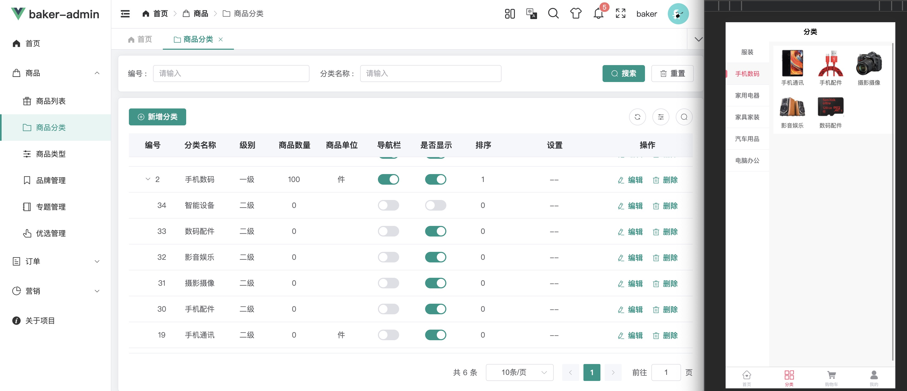
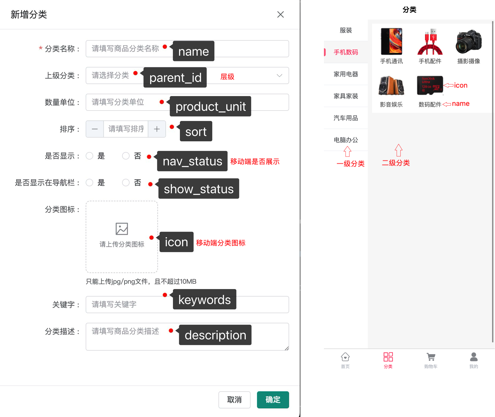

# 1、表设计
```sql
CREATE TABLE `pms_product_category`
(
    `id`            bigint       NOT NULL AUTO_INCREMENT COMMENT '分类编号',
    `parent_id`     bigint       NOT NULL DEFAULT '0' COMMENT '上级分类的编号：0表示一级分类',
    `name`          varchar(64)  NOT NULL DEFAULT '' COMMENT '分类名称',
    `product_unit`  varchar(64)  NOT NULL DEFAULT '' COMMENT '商品单位',
    `nav_status`    tinyint      NOT NULL DEFAULT '0' COMMENT '是否显示在导航栏：0->不显示；1->显示',
    `show_status`   tinyint      NOT NULL DEFAULT '0' COMMENT '显示状态，控制在移动端是否展示：0->不显示；1->显示',
    `sort`          int          NOT NULL DEFAULT '0' COMMENT '排序',
    `icon`          varchar(255) NOT NULL DEFAULT '' COMMENT '图标',
    `keywords`      varchar(255) NOT NULL DEFAULT '' COMMENT '关键字',
    `description`   text         NOT NULL COMMENT '描述',
    `level`         tinyint      NOT NULL DEFAULT '0' COMMENT '分类级别：0->1级；1->2级',
    `product_count` int          NOT NULL DEFAULT '0' COMMENT '商品数量',
    `created_at`    int          NOT NULL DEFAULT '0' COMMENT '创建时间',
    `updated_at`    int          NOT NULL DEFAULT '0' COMMENT '修改时间',
    PRIMARY KEY (`id`)
) ENGINE = InnoDB
  AUTO_INCREMENT = 1
  DEFAULT CHARSET = utf8mb4
  COLLATE = utf8mb4_0900_ai_ci COMMENT ='商品分类表'
```

# 2、页面
## 2.1、页面


## 2.2、添加分类


# 3、接口
